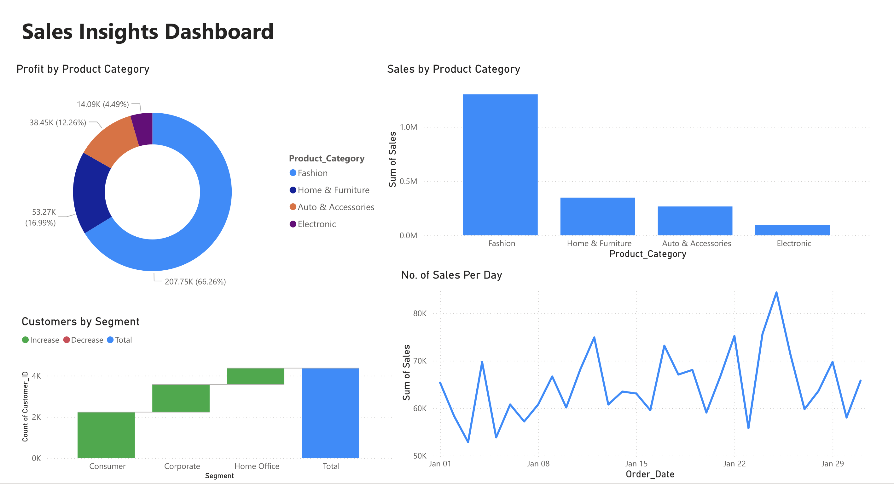
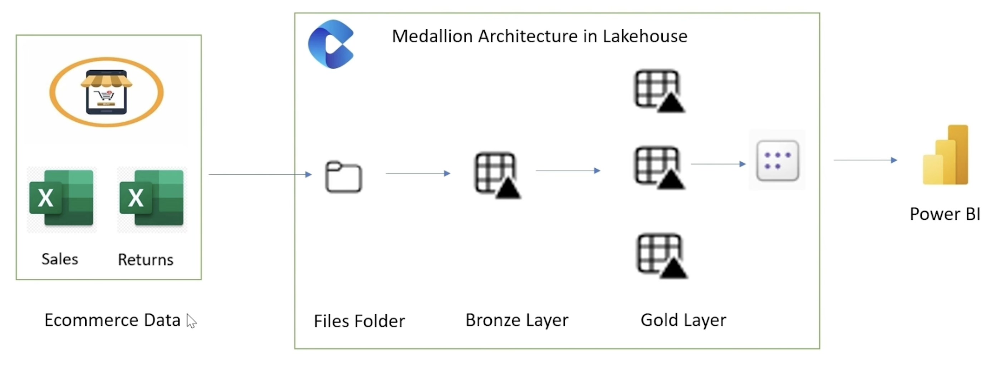
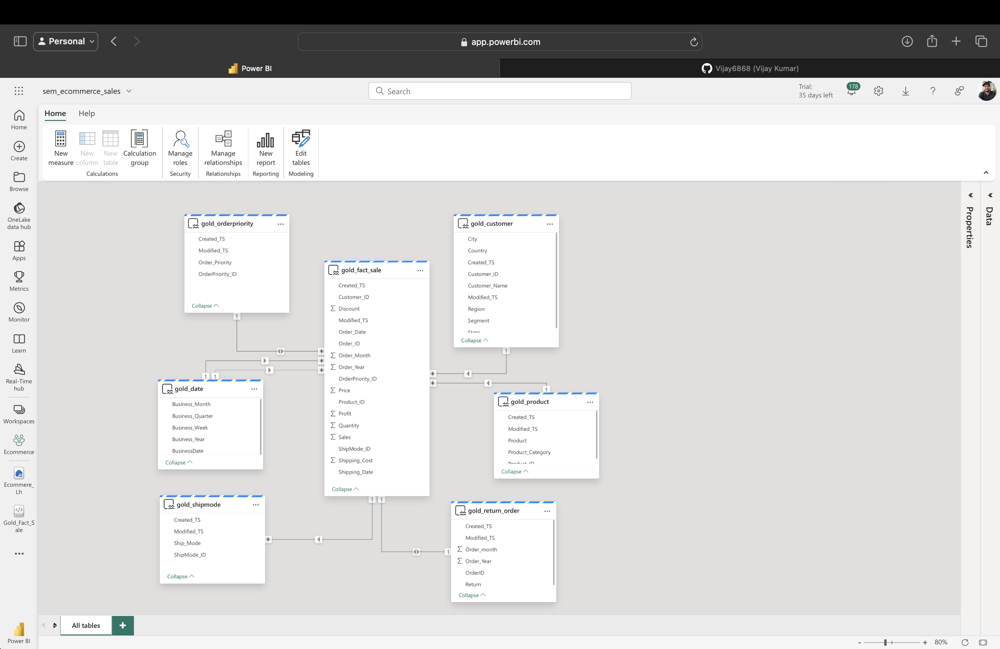
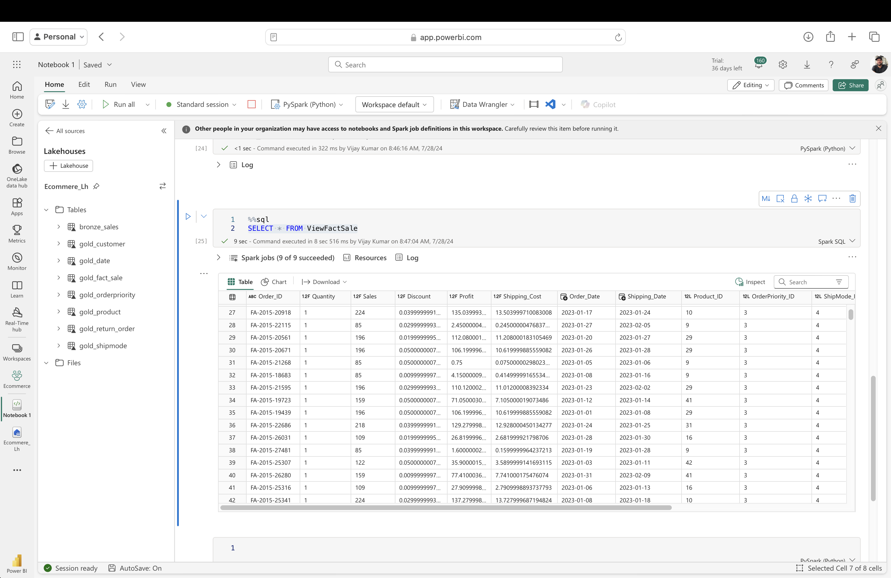

# Ecommerce Sales: End to End Project

This project demonstrates an end-to-end implementation of a Lakehouse architecture using Microsoft Fabric for handling e-commerce data. The project covers the entire data pipeline from ingestion to visualization.

## Project Overview

The goal of this project is to showcase how e-commerce data can be processed using a Medallion Architecture, leading to a comprehensive reporting solution in Power BI.

## Architecture

The project follows a structured architecture:

1. **Ecommerce Data**: 
   - The raw data is collected from e-commerce sources, including sales and returns data stored in Excel files.

2. **Files Folder**: 
   - The raw data files are ingested into the system and stored in a file folder.

3. **Bronze Layer**: 
   - In this layer, the raw data is ingested into the lakehouse, maintaining its original form but making it accessible for processing.

4. **Gold Layer**: 
   - The data is then processed and transformed into the gold layer, where it is cleansed and optimized for analysis.

5. **Power BI**: 
   - Finally, the cleansed and processed data is visualized using Power BI, providing insights and reports.

## Getting Started

### Prerequisites

- [Microsoft Fabric](https://www.microsoft.com/en-us/microsoft-fabric)
- [Power BI](https://powerbi.microsoft.com/)
- Basic knowledge of data processing and visualization

### Data Sources

- **Sales Data**: A dataset containing information about sales transactions.
- **Returns Data**: A dataset containing information about returned products.

### Steps

1. **Data Ingestion**: Upload the raw e-commerce data files (Sales and Returns) into the Files Folder in Microsoft Fabric.
2. **Bronze Layer Processing**: Import the data into the bronze layer, keeping it in its raw form.
3. **Data Transformation**: Clean and process the data, moving it to the gold layer.
4. **Visualization**: Connect the processed data in the gold layer to Power BI for creating visual reports.

## Acknowledgments

- [Microsoft Fabric Documentation](https://docs.microsoft.com/en-us/microsoft-fabric)
- [Power BI Documentation](https://docs.microsoft.com/en-us/power-bi)
  

